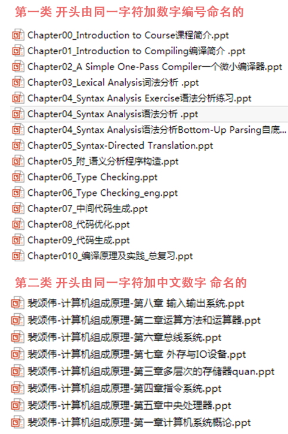

# 自动合并PPT 简要说明 v0.10
----
> 作者：`小磊`

> 邮箱：`ylxx@live.com`

> 时间：`2016-09-10`

## 一. 使用方法：

会自动排序 并合并`auto_merge_ppt.py`所在文件夹内的所有PPT

PPT的命名应满足如下两类要求：

且 **不能含有非此类命名规范的PPT**

由于PowerPoint效率 等待数分钟 即可完成（最后保存阶段等待时间稍长）

新PPT名字为所在文件夹名字+`.ppt` or `.pptx`

## 二. 环境

Python版本：`Python 2.7`

库：`win32com`(安装：`pip install  win32com` )

Office：`Office PowerPoint` 2010 以上版本（建议2013版）

## 三. 注意事项

程序中的`SLEEP_TIME` 变量为每一步操作间隔时间 默认为5s

若文件较大 PowerPoint 响应时间超过 `SLEEP_TIME`

则会失败 此时调大 `SLEEP_TIME` 即可
